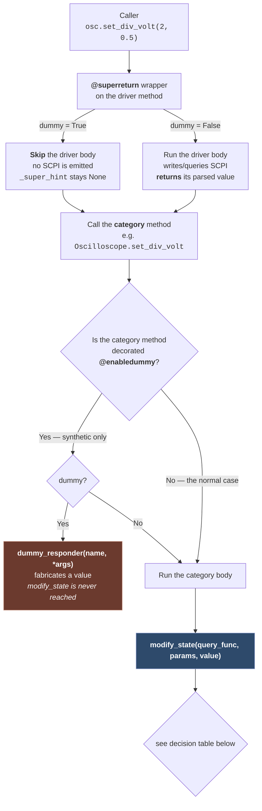
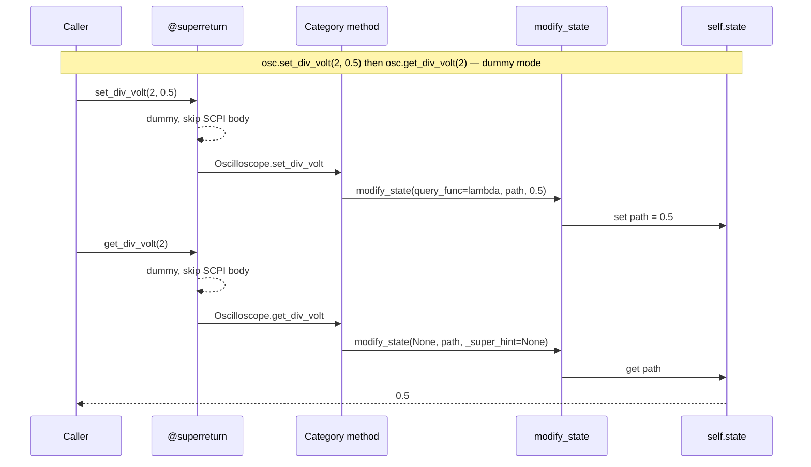
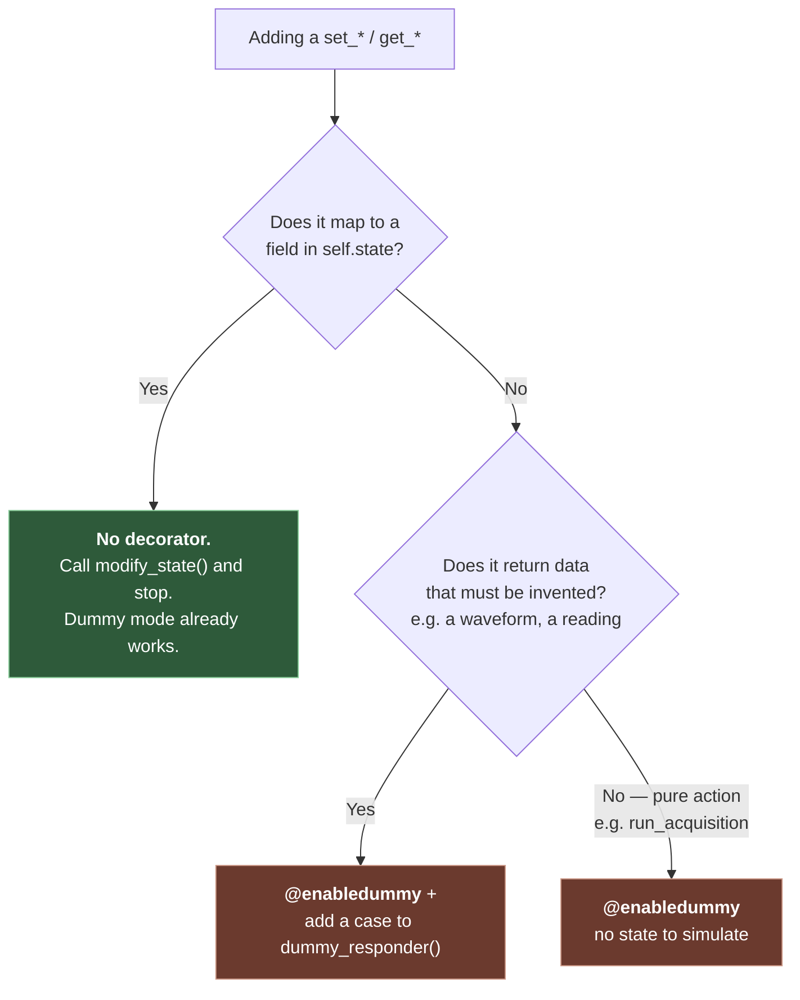
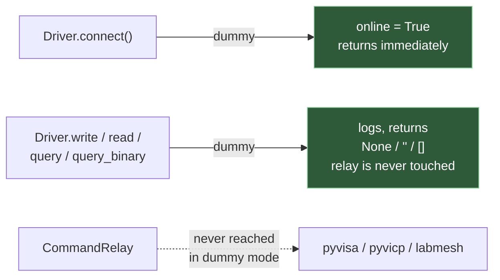

# Dummy mode: how it works

Dummy mode (`Driver(..., dummy=True)`) lets a driver be exercised with no hardware attached. The
goal is to test as much of a system as possible — including realistic state tracking — off the
bench.

As of the P3 pass (see `todo_list.md`), dummy mode has **one** dispatch mechanism:
`Driver.modify_state()`. A second, narrow escape hatch (`@enabledummy` → `dummy_responder()`)
exists only for values that have to be *invented*.

---

## The one rule

> **If a `set_*`/`get_*` maps to a field in `self.state`, it needs no dummy support at all.**
> `modify_state()` handles it. Only decorate a method with `@enabledummy` when dummy mode must
> fabricate data that isn't already tracked in state.

Decorating a plain setter is a bug: `@enabledummy` bypasses `modify_state()` entirely, so the
value is silently dropped unless `dummy_responder()` happens to have a matching case. That exact
mistake previously made five oscilloscope setters no-op in dummy mode with no error. A guard-rail
test (`test_enabledummy_only_on_synthetic_methods`) now pins down the allowed set.

---

## Dispatch flow

Every call enters at the driver, which is decorated `@superreturn`.



### How the driver's value reaches the category

A driver getter just **returns** its parsed value. `@superreturn` — a descriptor, so it can capture
the defining class via `__set_name__` — clears `self._super_hint` at the top of every call, stores
the driver's return value into it, then calls the category method, which reads it. In dummy mode
the driver body never runs, so the hint stays `None` and the read-back branch below takes over.

## `modify_state()` decision table

`query_func` is the discriminator: a **setter** passes a callable that would read the value back
from hardware; a **getter** passes `None`.

| `dummy` | `query_func` | Branch | Behavior |
|---|---|---|---|
| `True` | `None` (getter) | **dummy read-back** | Returns `state.get(params, indices, fragment)`. Does **not** write. |
| `True` | callable (setter) | store | Writes `value` into state, returns it. No hardware call. |
| `False` | `None` (getter) | store | Writes `value` (the driver's `_super_hint`) into state. |
| `False` | callable (setter) | verify | Calls `query_func()` — reads the value back from hardware, so state reflects what the instrument actually accepted. |
| any | callable, `blind_state_update=True` | store | Skips the readback; trusts the written value. |

The **dummy read-back** branch is the one added in P3, and it's what removes the need for a
hand-written `dummy_responder` case per getter. The reasoning: in dummy mode the driver's SCPI body
never ran, so `_super_hint` is `None` — writing it would clobber tracked state. Reading the tracked
value back is what a real instrument would have reported.

## Why a getter needs no dummy code



The setter stored it; the getter reads it back. Neither needed a line of dummy-specific code.

---

## When to use `@enabledummy`



### The complete list of methods still carrying `@enabledummy`

Seven, down from 51. Anything not on this list must not be decorated.

| Class | Method | Why |
|---|---|---|
| `Oscilloscope` | `get_waveform` | Generates a synthetic clipped sine from the current timebase/scale |
| `Oscilloscope` | `run_acquisition`, `stop_acquisition` | Pure hardware actions, no state |
| `Oscilloscope` | `do_single_trigger`, `do_force_trigger` | Pure hardware actions, no state |
| `PowerSupply` | `get_measured_output` | Measured V/I are readings, not settings — setpoint + noise |
| `BasicVectorNetworkAnalyzerCtg` | `get_trace_data` | Measurement data, not a setting |

`ArbitraryWaveformGenerator`, `DigitalMultimeter` and `SpectrumAnalyzer` have **no**
`dummy_responder` override at all — every case they used to have was literally
`self.state.get(<same path>)`, which the generic branch now does.

`MeasurementsMixin.get_measurement` is a special case: it is *not* decorated (so state tracking
still runs), but branches on `self.dummy` internally to call `_dummy_measurement()`, which computes
VMAX/VMIN/VPP/VAVG/FREQ from the driver's own dummy waveform. Dummy measurements therefore agree
with what `get_waveform()` returns rather than being a fixed sentinel.

---

## The other two layers

`modify_state()` is the *state* layer. Two lower layers also short-circuit in dummy mode, so no
driver ever needs to guard a SCPI call itself:



A `Driver` in dummy mode still *constructs* its relay (so `relay=` stays swappable), but never
calls through it.

---

## Seeding initial state

Because dummy getters read state back, a driver's state must start populated or getters return
`None`. Each category does this in `init_dummy_state()`, called from its `__init__` when
`dummy=True`:

```python
def init_dummy_state(self) -> None:
    self.set_div_time(10e-3)
    self.set_offset_time(0)
    for ch in range(self.first_channel, self.first_channel + self.max_channels):
        self.set_div_volt(ch, 1)
        self.set_offset_volt(ch, 0)
        self.set_chan_enable(ch, True)
        self.set_coupling(ch, self.COUPLING_DC)
    self.remake_dummy_waves()
```

It's written with ordinary setters — in dummy mode those land straight in state.

> **Known gap:** `SpectrumAnalyzer` and the VNA have empty `init_dummy_state()` bodies, so their
> dummy state starts all-`None`. Tracked in `todo_list.md`.

---

## Adding a new driver method: checklist

1. Write the category method to call `modify_state()` with the state path. **Stop here** — dummy
   mode works.
2. Write the driver method with `@superreturn`, emitting SCPI. A getter simply **returns** its
   parsed value — `@superreturn` captures that into `self._super_hint` for the category method.
   Drivers never assign `_super_hint` themselves.
3. Add the parameter to `init_dummy_state()` so it starts at a realistic value.
4. Only if the value is fabricated rather than tracked: add `@enabledummy`, a `dummy_responder()`
   case, and an entry in `ALLOWED_ENABLEDUMMY` in `tests/test_dummy_state.py`.

## Related

- `todo_list.md` — outstanding work.
- `docs/dummy_and_state_review.md` — the original review that motivated this design.
