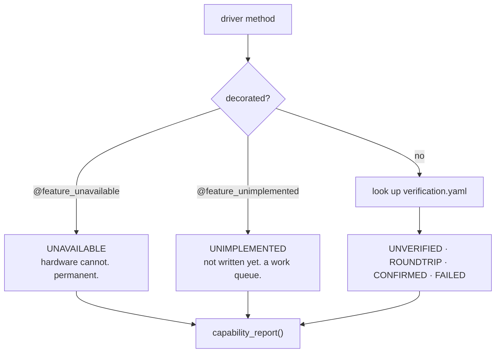

# Hardware verification

*How Constellation records which driver methods have actually been checked against a physical
instrument — and why that is a different question from what the instrument can do.*

## The problem

Nothing in a repository tells you whether `set_trigger_level()` was ever run against a real scope.
Git history answers *"was this diff reviewed"*; it does not answer *"does this SCPI string do what
we think on a DS1054Z at firmware 00.04.04"*.

That second fact has properties git can't carry:

- it is **per-method**, not per-commit — a change touching twelve methods may have been checked for
  three;
- it is **per-model** — a DS1052E and a DS1054Z share one driver, and a command can work on one and
  not the other;
- it is **perishable** — a firmware update can invalidate it;
- it is **re-checkable** — unlike a merge approval, you can run it again next month;
- and it is **user-facing** — the person picking up your VNA driver wants to know which methods are
  trustworthy.

So it is recorded as data in the repository, not as process around it.

## Two halves, deliberately separate

| | question | lives in | written by |
|---|---|---|---|
| **capability** | *Can this instrument do this at all?* | driver source, as decorators | a human, when writing the driver |
| **verification** | *Has the implementation been checked against hardware?* | `verification.yaml` | the hardware test run |

Capability belongs next to the method because it is a property of the instrument. Verification
belongs in a data file because it is an *event* — with a date, a model, a firmware and an operator
— and because a test run can then write it, which a human typing dates into source cannot be
trusted to keep accurate.

**Capability is never restated in YAML.** It is derived, and a cross-check test fails if a file
tries to duplicate it.



## The three code-side states

There are genuinely three, and using two markers for them loses the information that matters most:

```python
@feature_unavailable("DS1000E cannot query the timebase over SCPI")
def get_div_time(self):
    pass                     # permanent. no driver work will change this.

@feature_unimplemented("SCPI is documented but not written or checked")
def get_trigger_level(self):
    pass                     # a to-do. someone should pick this up.

@superreturn
def get_div_volt(self, channel:int):
    return float(self.query(f":CHAN{channel}:SCAL?"))   # implemented -> verification applies
```

The two decorators behave identically at the call site — both raise `FeatureUnavailable`, both are
skipped during state sweeps — but they mean opposite things about the future.
`unavailable_features()` lists what will never work; `unimplemented_features()` lists what someone
should go and finish. `RigolDS1000E` is the worked example: four of the first, sixteen of the
second.

## The two flavours of "verified"

A round trip can be **self-consistently wrong**. If a driver's setter writes the timebase and its
getter also reads the timebase, then setting volts/div and reading it back agrees perfectly — and
the driver is broken. No machine can catch that; only a person looking at the instrument's front
panel can.

So there are two statuses, and they record different facts:

| status | meaning |
|---|---|
| `unverified` | implemented, never checked against hardware. |
| `roundtrip` | set/read-back agreed on real hardware. Proves the set/get pair is **self-consistent** — *not* that it controls the parameter it claims to. |
| `confirmed` | a person watched the instrument and confirmed the physical effect. |
| `failed` | checked and did not work. Kept deliberately: "we tried and it broke" is far more useful than "nothing is known". |

Note that for **action commands** — `run_acquisition`, `do_single_trigger`, `preset` — there is no
read-back at all. `roundtrip` is not merely weaker for those; it is unreachable. They can only ever
be `confirmed`.

`failed` is never outranked into silence by a weaker passing record. It is evidence of *not*
working, not weak evidence of working.

## Staleness — how a record expires

A record that can never expire is worse than no record, because it produces the exact failure this
whole scheme exists to prevent: a driver is verified on hardware, then changed, and a later user
reads `confirmed` and trusts it.

Three independent things can invalidate a record, checked in order of specificity so the user is
told the most actionable thing:

| what changed | detected by | reported as |
|---|---|---|
| the driver method itself | normalized hash of the method's source | `stale-code` |
| the shared instrument-I/O path | `VERIFICATION_EPOCH` recorded with the run | `stale-framework` |
| the instrument | live `*IDN?` vs the recorded one | `stale-firmware` |

**All of them report as *not verified*.** The detail says why, the headline never claims
verification. Fail closed.

### Why a per-method hash, not a commit hash

A commit hash records *when*, not *whether the relevant code changed*. It invalidates every record
in the project on any commit, needs git to interpret, and is meaningless in an installed wheel with
no `.git`. So `method_code_hash()` hashes the method's own source instead — parsed to an AST with
decorators, docstring and name stripped, so reformatting or a comment does **not** invalidate
hardware evidence while a changed SCPI string does. That distinction matters more than it sounds:
a hash that flips on cosmetic edits trains people to ignore staleness, and then it protects nobody.

### Why the framework epoch is manual

A per-method hash cannot see that `modify_state()` or the relay path changed underneath it. The
tempting fix — hashing the whole call graph — is the failure mode that kills these systems: any
`base.py` edit would invalidate every record at once, and after the second wall of red nobody reads
them.

So the judgement is human: **`VERIFICATION_EPOCH` in `verification.py` is bumped when a change to
the shared I/O path could plausibly change what drivers do to hardware.** Every record stamped with
an older epoch becomes `stale-framework`.

What *is* automated is noticing that you touched the plumbing.
`FRAMEWORK_CRITICAL_FUNCTIONS` is a short, explicit list — `Driver.write/read/query`,
`_relay_attempt`, `_ensure_online`, `modify_state`, `superreturn.__call__`, and the
`DirectSCPIRelay` methods — and a test fails if their combined fingerprint changes:

```
The shared instrument-I/O path changed. Decide whether that could alter what drivers do to
hardware: if so bump VERIFICATION_EPOCH, then update EXPECTED_FRAMEWORK_FINGERPRINT.
```

Either answer is fine; what the test guarantees is that the question gets asked. Same pattern as
`ALLOWED_ENABLEDUMMY` — the machine catches the omission, a human makes the call.

### What only claims of success can go stale

`unverified` has nothing to invalidate, and a `failed` record does not become less of a failure
because the code moved on. Only `roundtrip` and `confirmed` are subject to expiry.

And absence of information is never treated as evidence of staleness: with no instrument connected,
firmware staleness simply isn't assessed, so an offline report doesn't cry wolf on every record.

### What this deliberately does not catch

Being honest about the edges is part of the design, since the alternative is false confidence:

- a driver method calling a **helper in the same file** that changed — fixable with a whole-class
  hash, at the cost of much coarser invalidation;
- a behaviour change in a **dependency** (pyvisa, labmesh) — recording their versions makes it
  diagnosable afterwards, not detectable up front;
- the **instrument itself** drifting — recalibration, a different probe. No software sees that.

## The record format

`verification.yaml` sits **in the same directory as the drivers it describes** —
`src/constellation/instrument_control/<category>/drivers/verification.yaml`. It is package data, so
it ships with the install and, crucially, a driver that moves to its own repository (see the planned
split of VICP/DAQmx/zhinst drivers) carries its own records with no central registry to keep in
sync. The file is located relative to the driver's own source file, so this works with no
configuration.

```yaml
RigolDS1000Z:
  set_div_volt:
    - status: confirmed
      idn: "RIGOL TECHNOLOGIES,DS1054Z,DS1ZA123456789,00.04.04.SP4"
      model: DS1054Z
      firmware: "00.04.04.SP4"
      code_hash: "13ce70dcf266a20b"
      epoch: 1
      date: 2026-08-20
      by: GG
      note: "front panel CH1 vertical scale read 2 V/div"
    - status: failed
      idn: "RIGOL TECHNOLOGIES,DS1052E,DS1EA000000000,02.01"
      model: DS1052E
      firmware: "02.01"
      code_hash: "13ce70dcf266a20b"
      epoch: 1
      date: 2026-08-21
      by: GG
      note: "command accepted, scale unchanged"
  set_trigger_level:
    - {status: unverified}
```

Records are written as single-line flow mappings (`- {status: confirmed, model: DS1054Z, ...}`);
they are expanded here for readability. Everything except `by` and `note` is captured automatically by the run — which is why the fields
can be trusted for expiry checks later, in a way that hand-typed dates cannot.

Records are a **list per method, keyed by model**, because the interesting answer later is
"confirmed on the DS1054Z, never tried on the DS1052E". A schema that can't express that has to be
migrated the first time a second model is plugged in.

`roundtrip` and `confirmed` records must carry `model`, `firmware`, `date`, `code_hash` and
`epoch` — a bare "verified" is not a fact, because it can neither be re-checked nor expired. A test
enforces it.

## Running the checks

### Without hardware (runs in the normal suite)

`tests/test_verification_records.py` verifies nothing about any instrument. It keeps the
bookkeeping honest, which is the part that always rots:

1. **every category-API method** is either decorated or has a record — so a newly added category
   method cannot silently have no status;
2. **capability is not restated** in YAML — one fact, one source;
3. **no record names a method that no longer exists** — catches renames, the failure mode every
   hand-maintained table dies of;
4. records use only writable statuses (`unavailable`/`unimplemented`/`stale-*` are derived);
5. `roundtrip`/`confirmed` records carry the provenance that makes them expirable;
6. the framework fingerprint hasn't changed without an epoch decision.

`tests/test_verification_writer.py` and `tests/test_hardware_suite.py` cover the other half: the
rules the record writer applies, and what a run concludes from a set of results.

This is the same pattern `InstrumentState.__init_subclass__` and `ALLOWED_ENABLEDUMMY` use
elsewhere in the suite: make omission a test failure rather than relying on discipline.

### With hardware

```bash
# round-trip mode: fast, unattended, proves self-consistency
pytest tests/hardware --driver=RigolDS1000Z --address=TCPIP0::192.168.1.74::INSTR

# moderated mode: pauses at each step for a human to confirm the instrument's behaviour
pytest tests/hardware --driver=RigolDS1000Z --address=... --confirm
```

Hardware tests are marked `@pytest.mark.hardware` and skipped unless `--address` is given, so
`pytest tests/` on a laptop with nothing on the bench behaves exactly as it did before they
existed.

| option | meaning |
| --- | --- |
| `--address` | VISA resource string, or a labmesh relay id. Required. |
| `--driver` | Driver class name, e.g. `RigolDS1000Z`. Required. |
| `--confirm` | Moderated mode. The only way to earn a `confirmed` record. |
| `--channel` | Channel to exercise. Defaults to the driver's first channel. |
| `--operator` | Recorded as `by`. Defaults to `$USER`. |
| `--model` | Overrides the model parsed out of `*IDN?`. |
| `--recheck` | Re-run methods already confirmed instead of skipping them. |
| `--no-record` | Run everything, write nothing. A dry run. |
| `--dummy` | Smoke-test the harness with no instrument attached. Cannot write records. |

Three things the run does for you:

- **Skips what the driver declares it cannot do.** A `@feature_unavailable` method is skipped with
  its reason, not failed — a DS1000E is not broken for having no SCPI timebase.
- **Skips what is already confirmed** (moderated mode), so an interrupted session does not have to
  be re-answered from the top. Staleness is honoured: a confirmed record whose code has since
  changed is asked about again. `--recheck` forces everything.
- **Puts the instrument back.** The bench setup is snapshotted at connect and re-applied at the
  end. A suite that leaves the timebase somewhere random is a suite people stop running.

In moderated mode each check leaves the instrument sitting at the value in question and then asks:

```
------------------------------------------------------------------------------
Channel 1's VERTICAL scale should read 2 V/div, in that channel's badge at the bottom of
the screen. Check the channel number too: a driver that ignores its channel argument and
always writes channel 1 round-trips perfectly.
Did the instrument do this? [y]es / [n]o / [s]kip:
------------------------------------------------------------------------------
```

The prompt has to name the *physical* thing to look at, and the control it would most plausibly be
confused with. That is the entire value of the mode, and it means prompt text is per-method content
living with the test, not boilerplate. `n` records a **failure** — a human saying "the front panel
did not do that" is the strongest negative evidence available. `s` records nothing.

Action commands (`run_acquisition`, `stop_acquisition`, `do_single_trigger`, `do_force_trigger`)
have no read-back, so round-trip mode does not merely test them weakly — it *skips* them, and
`confirmed` is the only status they can ever hold.

### Smoke-testing the harness without an instrument

```bash
pytest tests/hardware --dummy --driver=RigolDS1000Z            # and --confirm, to walk the prompts
```

`--dummy` runs the whole suite against a dummy driver. It is for checking the harness — that the
checks are wired to the right methods, that the skips fire, that the prompts read sensibly — not
the driver. It **cannot write records**, enforced in the fixture rather than left to the operator
remembering `--no-record`: a dummy instrument is not evidence of anything, and a fabricated record
is worse than none.

### What a run writes

Results are collected over the session and written once at the end, so an interrupted run never
leaves a half-rewritten file. Three rules govern the merge (`src/constellation/verification_writer.py`):

1. **Never lower a status within the same code.** A later round-trip-only run does not downgrade a
   method a human confirmed — and it does not restamp its date either, because nobody looked at the
   front panel today. The qualifier matters: an old `confirmed` cannot lend its strength to an
   implementation that has since changed, so when the code hash differs the new record *replaces*
   the old outright. Laundering unconfirmed code as human-confirmed is exactly what the staleness
   layer exists to prevent.
2. **Always record failures.** A fresh failure replaces an earlier pass *on the same instrument*,
   so a regression is never masked by yesterday's success. Records for a *different* instrument
   accumulate alongside rather than overwriting — one driver covers a series.
3. **Never destroy the header.** `yaml.safe_dump` of the whole document would delete the comment
   block explaining what the file is; the header is re-emitted verbatim and only record blocks are
   generated. Repeated identical runs produce a byte-identical file, so a real change shows up as a
   real diff.

Every one of these rules is pinned by a test in `tests/test_verification_writer.py`, and the
suite's own bookkeeping by `tests/test_hardware_suite.py` — both run without hardware, because the
logic that decides what gets believed later must not be checkable only by someone holding a scope.

## Reading the result

```python
from constellation.verification import capability_report, summarize_report

report = capability_report(scope)             # or a driver class, no instrument needed
report["set_div_volt"]["status"]              # VerificationStatus.CONFIRMED
report["set_div_volt"]["trusted"]             # True only if the claim still stands
report["get_div_time"]["detail"]              # "DS1000E cannot query the timebase over SCPI"

summarize_report(report)                      # counts per status, for a coverage table
```

`trusted` is the single field a UI needs. It is True only for a claim that survives every staleness
check; unverified, unimplemented, stale and failed are all False. Passing a connected `Driver`
rather than a class also supplies the instrument's live `*IDN?` automatically, so a report taken at
the bench notices records made against different firmware without the caller doing anything.

`capability_report()` merges both halves, so no caller needs to know they are stored differently.
It is what a GUI wants — grey out `unavailable`, badge `unverified` with a caution marker — and
what renders the per-driver coverage table.

## Adding a driver to the scheme

1. Create (or extend) `verification.yaml` in the driver's directory with a section named after the
   driver class.
2. Add every category-API method the driver implements, as `{status: unverified}`.
3. Decorate what the hardware cannot do with `@feature_unavailable`, and what is not written yet
   with `@feature_unimplemented` — do **not** give those YAML entries.
4. Add the class to `TRACKED_DRIVERS` in `tests/test_verification_records.py`.
5. Add it to `driver_registry()` in `tests/hardware/conftest.py`, so `--driver=<name>` can build it.
6. Run the suite. It will tell you exactly which methods you missed.

Steps 2 and 6 are the ones that make this maintainable: you never have to remember the method list,
because the test computes it from the category and reports the difference.

## Adding a category to the hardware suite

`tests/hardware/conftest.py` and `hardware_support.py` are category-agnostic - the instrument
fixture, the confirmation prompt, the recorder, the skip rules, and the `Check`/`run_check` pair
that drives one set/get pair and records its outcome all know nothing about oscilloscopes. A new
category needs one module, `tests/hardware/test_<category>_hw.py`, containing the checks
themselves: which set/get pairs to drive, with what values, and **what a human should see on the
front panel**. That last part is the only irreducible work, and it is the part worth the time -
the rest is a table.

`test_oscilloscope_hw.py` and `test_arb_waveform_generator_hw.py` are the references. Because
drivers implement a category API, one module covers every driver in that category; per-driver
differences are handled by the capability decorators, which the runner skips on automatically.

Two things a new module owes the suite:

- **A category guard.** A run collects every category module but has exactly one instrument on the
  bench, so each module opens with an autouse fixture calling `requires_category(instrument, <Category>)`.
  Without it, pointing the suite at a signal generator runs the oscilloscope module against it and
  reports a screenful of failures about an instrument nobody claimed was a scope.
- **A setup, where a parameter only exists in some states.** `Check(setup=...)` runs once before
  the values. An AWG has no frequency or peak-to-peak amplitude to read back while it is generating
  noise, so every AWG check that isn't about the waveform type starts from a known sine.
