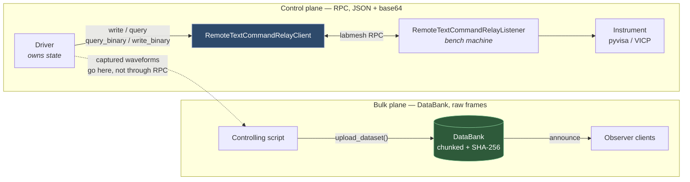

# Networking: which path does data take?

Constellation's labmesh integration has **two independent channels** with different capabilities.
Choosing the wrong one is the difference between a fast, correct transfer and a silently degraded
one, so this page states the rule and the reason behind it.

| | RPC (relay) | DataBank |
|---|---|---|
| Shape | request → response, blocking | store → announce → fetch, asynchronous |
| Encoding | **strictly JSON** (`labmesh.util.dumps` = `json.dumps`) | JSON header + **raw bytes** in a separate ZMQ frame |
| Binary support | only via base64 inside the JSON envelope | native, no encoding overhead |
| Chunking | none | yes, sequenced |
| Integrity check | none | size + SHA-256 |
| Used by | `RemoteTextCommandRelayClient` / `...Listener` | `upload_dataset()` / bank retrieval |
| Right for | instrument control, single reads/writes | captured datasets, bulk results |

---

## Why binary on the RPC path is base64

labmesh's RPC envelope is JSON, with no exceptions:

```python
# labmesh/util.py
def dumps(obj): return json.dumps(obj, separators=(",", ":")).encode("utf-8")
def loads(b):   return json.loads(b.decode("utf-8"))
```

JSON has no bytes type, so raw binary genuinely cannot travel this way. The two options are
base64, or a JSON list of numbers. Measured on a 250,000-point waveform (the DS1000Z's maximum
single-chunk transfer):

| encoding | size |
|---|---|
| raw bytes | 244 KB |
| **base64 — what Constellation uses** | **326 KB** |
| JSON int list | 1116 KB (3.4x larger) |

So `query_binary`/`write_binary` pack the values little-endian with the caller's `datatype` and
base64 the result. **Little-endian is explicit, not native**, so the bench machine and the
controlling machine don't have to share an architecture.

This is not a Constellation-invented alternative to something labmesh already offers — on the RPC
path there is no other option.

## Why control traffic doesn't use the DataBank instead

The DataBank has a genuinely better binary protocol — raw frames, chunking, SHA-256:

```
ingest_start: {dataset_id, relay_id, meta, size, sha256}
ingest_chunk: {dataset_id, seq, eof:false} + [binary chunk]   <- raw bytes, separate frame
ingest_chunk eof:true -> bank verifies size + sha256 -> ingest_done
```

But it is a **store**, not a call. You upload a dataset, it lands on disk under a `dataset_id`, and
consumers fetch it later. Routing `get_waveform()` through it would mean upload → poll → download,
which is the wrong shape for a blocking `Driver.query()` and adds a disk round trip to every read.



## The rule

- **Instrument control and single reads/writes → RPC.** `write`, `read`, `query`, `query_binary`,
  `write_binary`. This is what `CommandRelay` is for, and it keeps `Driver`'s synchronous
  semantics intact.
- **Captured datasets and bulk results → DataBank.** See
  `examples/rigol_ds1000z_network/controller_client.py`, which reads a waveform over RPC and then
  uploads it to the bank for other clients to consume.

### Where the RPC path runs out

Base64-over-JSON has no chunking and no integrity check. It is fine at the ~326 KB measured above,
but it is not the right vehicle for multi-megabyte transfers — the whole payload is one JSON
message held in memory on both ends, with nothing verifying it arrived intact.

**If you find yourself pushing several MB through `query_binary`/`write_binary`, that is the signal
to use the DataBank instead.** There is currently no guard warning about this; see `todo_list.md`.

---

## Binary block API

Both directions are symmetric and available at every layer.

| Layer | Read | Write |
|---|---|---|
| `Driver` | `query_binary(cmd, datatype)` | `write_binary(cmd, values, datatype)` |
| `DirectSCPIRelay` | pyvisa `query_binary_values()` | pyvisa `write_binary_values()` |
| `VICPDirectSCPIRelay` | not supported | builds the IEEE header by hand |
| `RemoteTextCommandRelayClient` | base64 over RPC | base64 over RPC |

`datatype` is a struct format character, following PyVISA's convention — `'B'` unsigned byte,
`'h'` signed 16-bit, `'i'` signed 32-bit, `'f'` float, and so on.

### Reading: `query_binary`

```python
volts = osc.query_binary(":WAV:DATA?", datatype='B')
```

### Writing: `write_binary`

The practical use is loading an arbitrary waveform into an AWG, where sending the same points as
comma-separated ASCII is several times larger and much slower:

```python
points = [int(32767 * math.sin(2 * math.pi * i / 1024)) for i in range(1024)]
awg.write_binary(":WVDT WVNM,mywave,WAVEDATA,", points, datatype='h')
```

`write_binary()` returns `True` on success. In dummy mode it returns `True` without touching the
relay — nothing was written, but nothing failed, so callers that check the result behave the same
as they would against hardware.

### Relays that can't

`VICPDirectSCPIRelay` has no `query_binary` (pyvicp gives no block parser). Unsupported operations
raise `NotImplementedError` from the base `CommandRelay`, which `Driver` catches and logs like any
other relay failure — and which the network **listener** converts into a clean failure return
rather than letting it escape into the `RelayAgent`.

## Related

- `docs/labmesh_migration_plan.md` — the "smart client, dumb relay" design.
- `docs/superreturn.md`, `docs/dummy_mode.md` — driver-side plumbing.
- `todo_list.md` — open networking work: no reconnection path, unbatched `refresh_state()`.
