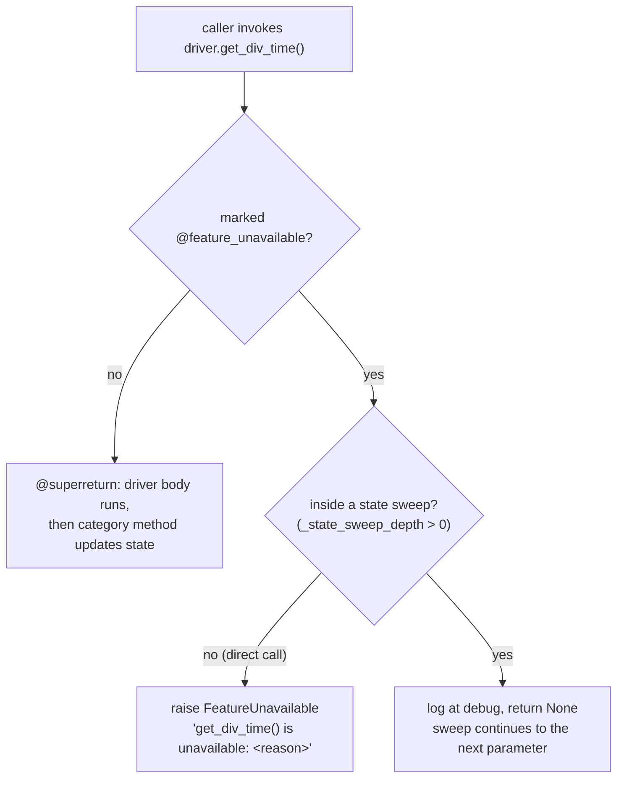
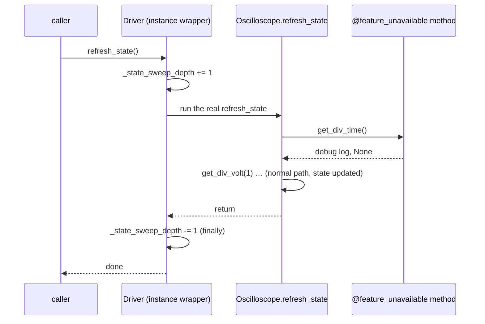

# Partial category compliance — `@feature_unavailable`

## The problem

Constellation's category classes (`Oscilloscope`, `PowerSupply`, …) declare the full API every
driver of that category must implement, using `@abstractmethod`. That is what makes drivers
interchangeable: any `Oscilloscope` can be handed to code that calls `get_div_time()`.

Real lab hardware does not cooperate with that. A Rigol DS1000E has no SCPI command to read or
set its timebase — not "not implemented yet", *not possible*. Under a strict abstract API such a
driver has two bad options:

1. **Omit the methods.** Python then refuses to instantiate the class. One hardware gap makes the
   entire driver unusable, and the failure appears as an opaque `TypeError: Can't instantiate
   abstract class ... with abstract methods ...` at construction, far from the feature in
   question.
2. **Stub them out with a warning.** This is what `RigolDS1000E` used to do:

   ```python
   @superreturn
   def set_div_time(self, time_s:float):
       self.warning("DS1000E model does not support setting timebase remotely.")
   ```

   Worse than it looks. `@superreturn` still forwards to the category method afterwards, which
   writes `time_s` into `self.state`. The state tracker then reported a timebase the instrument
   had never been told about, and `get_div_time()` handed it back as though it had been read from
   hardware. A silent lie is worse than a loud failure.

## The mechanism

`base.py` provides `FeatureUnavailable(RuntimeError)` and the `@feature_unavailable(reason)`
decorator.

```python
@feature_unavailable("DS1000E cannot query the timebase over SCPI")
def get_div_time(self):
    pass
```

The decorated method **satisfies the abstract method**, so the class becomes constructible, and
calling it raises `FeatureUnavailable` naming the method and the reason. The body never runs and
is conventionally `pass`.

> Do **not** stack this with `@superreturn`. The point is that no driver body runs and nothing is
> written into `self.state` — there is no value to track.



## Three behaviours that make it usable

### 1. Constructible

The working majority of the driver is reachable. `RigolDS1000E` can read and set per-channel
volts/div, offsets, channel enables and waveforms; only the genuinely impossible calls fail.

### 2. Introspectable *before* the call

Catching an exception after the user has clicked a button is not how a GUI should discover that a
control does nothing.

```python
scope.feature_is_available("get_div_time")   # False
scope.feature_is_available("get_div_volt")   # True

scope.unavailable_features()
# {'get_div_time': 'DS1000E cannot query the timebase over SCPI', ...}
```

`unavailable_features()` reads the *class*, via `inspect.getattr_static`, so it neither binds
methods nor triggers properties. `feature_is_available()` returns `False` for names the driver
doesn't have at all, since those can't be called either.

### 3. Skipped during state sweeps

`refresh_state()`, `apply_state()`, `refresh_data()` and `init_dummy_state()` call every
getter/setter in the category unconditionally. One `FeatureUnavailable` escaping would abort the
sweep partway through and leave every parameter after it stale.

Inside those four methods, an unavailable feature logs at debug and returns `None`. Direct calls
still raise — silence is only appropriate when the caller is iterating over everything rather
than asking for this feature specifically.

This is implemented in `Driver._wrap_state_sweeps()`, called once from `Driver.__init__`. It
wraps the instance's bound sweep methods in a depth counter (`_state_sweep_depth`), which
`@feature_unavailable` consults.



Two design notes:

- **Why wrap in `Driver.__init__` rather than edit each category?** Those four methods are
  abstract on `Driver`; every category writes its own, including categories that don't exist yet.
  Wrapping once at construction means a new category gets the behaviour for free and cannot
  forget it.
- **Why an instance attribute?** It shadows the class method for normal calls but leaves the class
  attribute untouched, so `super().refresh_state()` chains inside category/driver code resolve
  normally and are not double-wrapped. The counter is decremented in a `finally`, so an unrelated
  mid-sweep failure can't leave the driver permanently suppressing `FeatureUnavailable`.

## Dummy mode

An unavailable feature **raises in dummy mode too**. Dummy mode simulates *this instrument*, and
this instrument cannot do this — a dummy that quietly succeeded would hide the failure until
hardware day, which defeats the purpose of dummy mode.

The consequence is that a partially-compliant driver has genuinely unset state in dummy mode:
`init_dummy_state()` seeds defaults through the setters, so `RigolDS1000E`'s `div_time` stays
`None`. Code that derives from such a parameter has to tolerate it —
`Oscilloscope.remake_dummy_waves()` falls back to a nominal timebase rather than raising
`TypeError` on `None`. (That mirrors the hardware: the real DS1000E driver returns sample *index*
rather than seconds, because it has no way to know the time axis.)

## Writing a partially-compliant driver

1. Define **every** abstract method of the category.
2. Mark the impossible ones with `@feature_unavailable("<what the hardware can't do>")`. Write the
   reason as a hardware statement — "DS1000E cannot query the timebase over SCPI", not
   "unsupported". It is quoted verbatim in the exception and returned by
   `unavailable_features()`.
3. Do not add `@superreturn` to them.
4. If dummy mode or any derived calculation depends on a parameter the instrument can't report,
   give that path a fallback.

`RigolDS1000E` is the reference example.

## Caveat on the current DS1000E

Sixteen of its methods (coupling, probe attenuation, bandwidth limit, trigger mode/level/source,
run/stop/single/force) are currently marked unavailable with the reason *"not yet implemented —
SCPI support unverified on hardware"*. That wording is deliberate and different from the timebase
entries: those sixteen have **not** been established as hardware limitations. The DS1000E
programming guide appears to document commands for most of them, so each is expected to become a
real implementation once checked on the bench. Converting one is a single-method edit — delete the
decorator, add `@superreturn` and the SCPI body. See `todo_list.md` P2.
