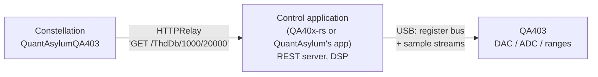

# QuantAsylum QA403

*How the QA403 is actually controlled, why its Constellation driver behaves differently from a SCPI
instrument, and the quirks worth knowing before you trust a number from it.*

Driver: `QuantAsylumQA403` in
`src/constellation/instrument_control/audio_analyzer/drivers/QuantAsylum_QA403_dvr.py`.
Category: `AudioAnalyzer`.

## The short version

```python
from constellation.all import *

qa = QuantAsylumQA403("http://localhost:9402", plf.LogPile())   # a control app must be running

qa.set_generator_freq(1, 1000)
qa.set_generator_amplitude(1, -10)
qa.set_generator_enable(1, True)

thd = qa.get_thd("left", 1000, 20000)       # captures first, then measures (default policy)
```

- **A PC application must be running** with the analyzer plugged into it. Constellation talks to that
  application, never to the analyzer.
- **Every capture plays the enabled generators** on the outputs. With the default trigger policy,
  every data or measurement getter captures, so check what is connected before running anything.
- **Settings cannot be read back.** `get_sample_rate()` and the other settings getters raise
  `FeatureUnavailable`; read `qa.state` for what was last sent.
- **Left and right are physical inputs**, whichever application is serving them.

## How the QA403 works

The QA403 is essentially a precision USB audio interface: a DAC for the generator, an ADC for the
inputs, and switchable input and output ranges. **It does no analysis of its own.** A PC application
does all of it:

1. writes registers over USB to set sample rate, input range and output range, and to start and stop
   an acquisition;
2. streams generator samples out to the DAC and reads ADC samples back;
3. computes the FFT, THD, RMS and every other measurement in software.

That application also runs a REST server (JSON over HTTP, port 9402 by default), and that server is
what Constellation talks to:



So a `get_thd()` call ends at the application, which answers from samples it already holds. Nothing
past the REST server is visible to Constellation, and every quirk below belongs to an application,
not to the analyzer.

### Two applications

| | QA40x-rs | QuantAsylum's official application |
|---|---|---|
| Source | open (Rust + Tauri, [GarageDeveloper/qa40x-rs](https://github.com/GarageDeveloper/qa40x-rs)) | closed |
| Platforms | macOS, Linux, Windows | Windows |
| Tested with this driver | yes (v0.4.0) | **no** |

Both serve the same REST scheme. Every reply carries a `SessionId`; QA40x-rs always sends the constant
`"qa40x-rs"`, which is how the driver tells the two apart and decides which workarounds to apply.

### The USB protocol (for reference)

Constellation does not use this, but it is not a black box. QA40x-rs documents it in
[`doc/device-notes.md`](https://github.com/GarageDeveloper/qa40x-rs/blob/main/doc/device-notes.md):

- **Control** is a register bus over bulk USB endpoints. A write sends the register address and a
  4-byte value; a read sends the address with the high bit set (`0x80` reads register `0x00`).
  Register `0x05` is input range, `0x06` output range, `0x09` a sample-rate *index*, `0x08` starts and
  stops an acquisition. Steady register traffic is what keeps the LINK LED lit.
- **Audio** travels as interleaved stereo blocks of little-endian int32, with left and right swapped on
  the wire.

These notes are the QA40x-rs authors' findings; none of it has been checked from the Constellation
side.

## Triggering: how fresh is the data?

The analyzer only measures when told to capture, and **every data and measurement endpoint reports on
the most recent capture, however old it is.** Asking for THD does not take a new one.

On QA40x-rs, only a REST acquisition updates the capture the REST endpoints read. Captures made in the
application's own window never reach the API. A script that never triggers will keep reading the same
stale buffer - the symptom is identical readings, to every decimal place, for minutes on end.

The driver's trigger policy decides when captures happen. It is QA403-only - not part of the
`AudioAnalyzer` category:

| Policy | Behaviour |
|---|---|
| `TRIGGER_ON_GET` (`"on_get"`, **default**) | every data/measurement getter captures before reading |
| `TRIGGER_MANUAL` (`"manual"`) | only `send_manual_trigger()` captures |

Every data/measurement getter (`get_waveform`, `get_spectrum`, `get_rms_level`, `get_peak_level`,
`get_peak_freq`, `get_thd`, `get_thdn`, `get_snr`) also takes a keyword-only `acquire` flag: `None`
follows the policy, `True`/`False` overrides it for that one call.

**One capture records both channels.** The catch is that `on_get` captures once per *getter call*, so
these two readings come from different captures:

```python
qa.get_thd("left")     # capture 1
qa.get_thd("right")    # capture 2
```

To measure several things from the same capture, trigger once and read without re-acquiring:

```python
qa.set_trigger_policy(QuantAsylumQA403.TRIGGER_MANUAL)
qa.send_manual_trigger()
thd_left  = qa.get_thd("left")
thd_right = qa.get_thd("right")
level     = qa.get_peak_level("left", 950, 1050)
```

`send_manual_trigger()` blocks until the capture finishes. `refresh_data()` under `on_get` captures
once per getter it calls - four captures for spectrum and waveform on two channels.

There is no continuous (free-running) mode: neither application offers one over REST, and QuantAsylum
has said so. A background acquisition loop in the driver is logged in `todo_list.md` as a future
option.

## Settings are write-only

The REST API can set sample rate, buffer size, input range, window and generators, but cannot report
any of them. So:

- the settings getters are `@feature_unavailable` - listed by `qa.unavailable_features()`, raising
  `FeatureUnavailable` if called, skipped by `refresh_state()`;
- the driver runs with `blind_state_update`, so `qa.state` holds **what was last sent**, not what the
  application currently has. A change made in the application's window is invisible;
- a setting that fails validation, or that the application refuses, is not recorded;
- a setting never sent this session is `None` - unknown, not a default.

Start scripts from a known configuration with `preset()`: it resets the application, sends buffer
size 32768 and a FlatTop window, and switches both generators off. It does not touch sample rate or
input range.

### Generators

The API sets a generator's state, frequency and amplitude in **one** command
(`/Settings/AudioGen/Gen1/On/1000/-10`). The category keeps one parameter per setter, so the driver
composes that command internally:

- each of `set_generator_enable`, `set_generator_freq` and `set_generator_amplitude` sends all three
  fields - the new value plus the last values sent - and records all three;
- a field never sent this session goes out as its default (off, 1000 Hz, -10 dBV);
- **enabling a generator whose frequency or amplitude was never set is refused**, so it can't play a
  tone nobody chose;
- `set_generator(generator, enable, freq_Hz, amplitude_dBV)` is a QA403-only shortcut that sends all
  three in one call.

Amplitudes are in dBV, from -120 to +18.

## Channels

Channels accept `1`/`2` or `"left"`/`"right"` (any case), and always mean the **physical** inputs.

QA40x-rs reports left and right swapped in every JSON reply; the official application does not. The
driver reads the opposite key when the reply's `SessionId` is `"qa40x-rs"`, so you never have to.

## QA40x-rs quirks the driver absorbs

Read from QA40x-rs's `src-tauri/src/rest.rs`, and checked against v0.4.0 where noted.

| Quirk | Consequence if you script the REST API by hand | What the driver does |
|---|---|---|
| `/Data/Time` and `/Data/Frequency` are in digital full-scale units, not volts; range and calibration are applied only inside measurement endpoints | waveforms and spectra are off by the input-range offset (**checked: 45.53 dB** on both channels) | converts to volts using `/PeakDbv`, the calibrated peak of the same capture |
| Left and right are swapped in replies (reported from hardware use) | channels read backwards | reads the opposite key |
| `SessionId` is constant, `/AcquisitionBusy` always `"False"`, `/Acquisition` and `/AcquisitionAsync` are the same synchronous call | a loop waiting for `SessionId` to change **hangs forever** | uses blocking `POST /Acquisition` only |
| `/PeakDbv/{lo}/{hi}` ignores the band and returns the time-domain peak (**checked:** identical for four different bands) | "level at a frequency" returns the same number whatever frequency you ask for | warns once, then takes the highest spectrum bin in the band |
| `/ThdnDb` and `/SnrDb` ignore their band limits | results don't follow the band you asked for | nothing - documented only |
| `Dx` in `/Data/Time` has six decimals (1/48000 s → `"0.000021"`) | time axis 0.8% off at 48 kHz, 15% at 384 kHz | snaps the sample period to the nearest supported rate |
| `/Settings/Default` leaves Gen1 playing (the official app turns it off) | a "reset" analyzer still drives its outputs | `preset()` switches both generators off explicitly |
| Only `Data/*/Input` exists | no output-side data | not exposed |

Measurement values arrive as strings. The official application formats them with the host locale's
decimal separator (`"-12,5"`), and QA40x-rs sends `"-∞"` for a zero level; both are parsed.

## Connection and liveness

`address` is the server's base URL. The driver's default `HTTPRelay` probes `GET /Status/Connection`,
so the driver counts as online only if the application reports the analyzer attached. A running
application with no analyzer gives `connection_summary()["diagnosis"]` = *"The relay process is
reachable, but it cannot talk to the instrument."*

HTTP errors are classified for the reconnect policy: an unreachable server is a transport failure, a
4xx (unknown endpoint, bad value, nothing captured yet) is a usage error that is neither retried nor
treated as a lost connection, and a 5xx is an instrument error.

## Multiple analyzers

**QA40x-rs's REST server drives one analyzer.** Its source calls the server "mono-device by
specification": it always uses the default device, and a multi-device API is its open issue #69.

- The port is configurable with the `QA40X_REST_PORT` environment variable (default 9402). Whether two
  application instances on different ports would each claim a *different* QA403 is **unknown** -
  nothing confirms it works.
- **The reliable setup today is one computer per analyzer.** Run QA40x-rs on each with network access
  enabled (`QA40X_REST_EXPOSE`), which then requires a bearer token (`QA40X_REST_TOKEN` pins it):

  ```python
  qa2 = QuantAsylumQA403("http://bench-pc-2:9402", log,
      relay=HTTPRelay(token="...", probe_cmd="GET /Status/Connection"))
  ```

  (A relay you build yourself doesn't get the driver's "analyzer attached" probe check automatically -
  pass `probe_check` too if you want it.)
- Whether QuantAsylum's official application supports several units is unknown.

A longer-term alternative is a relay that speaks the USB register protocol directly, addressing each
unit by serial number. It would remove the application and all of its quirks - but the analyzer does
no analysis, so FFT and THD would then have to live in Constellation, and it would add a USB
dependency that belongs in a separate repository under the dependency-split plan.

## Not yet done

Tracked in `todo_list.md`: no setting or capture has been sent to real hardware through this driver
yet (only read-only calls); the official application is untested; there is no hardware test suite,
`verification.yaml` or GUI for this category; and wrapping an `HTTPRelay` in a
`RemoteTextCommandRelayListener` should work but hasn't been run.

## References

- [QA40x REST API wiki](https://github.com/QuantAsylum/QA40x/wiki/QA40x-API)
- [qa40x-rs repository](https://github.com/GarageDeveloper/qa40x-rs) - `src-tauri/src/rest.rs`,
  `doc/device-notes.md`
- [QA402 & QA403 continuous run API](https://forum.quantasylum.com/t/qa402-qa403-continues-run-api/1732) -
  QuantAsylum on the absence of a continuous mode
