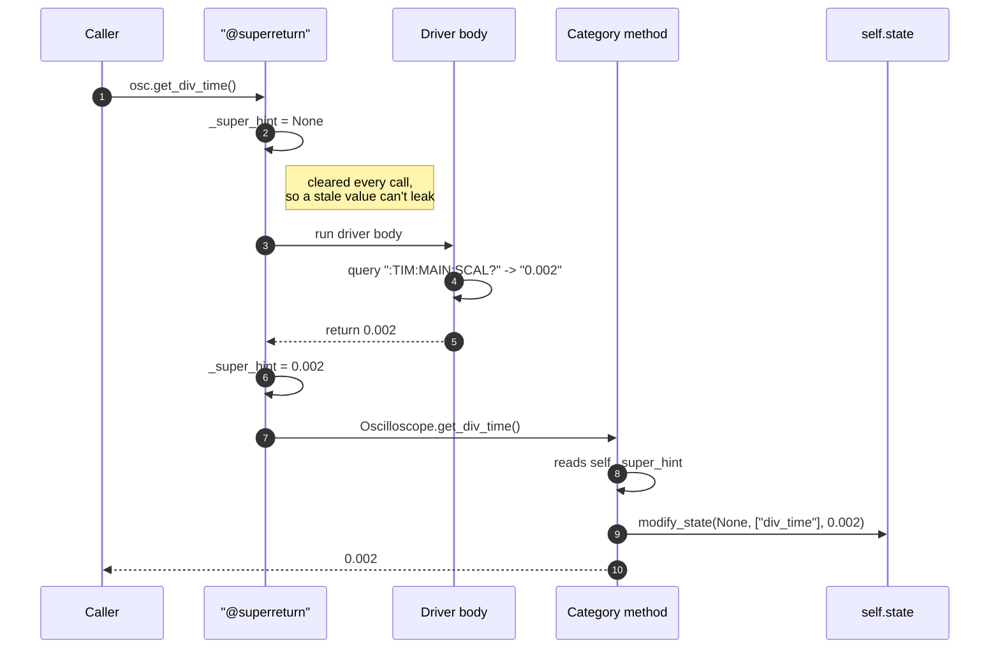
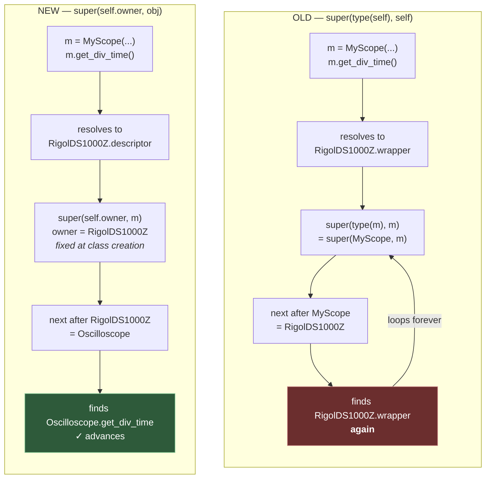
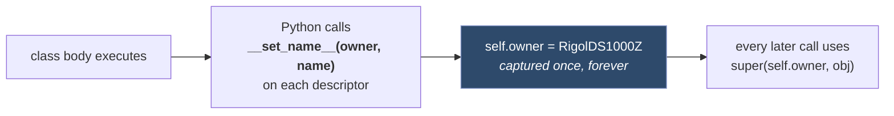

# `@superreturn`: how drivers hand values up to their category

`@superreturn` is the decorator on every driver-level `set_*`/`get_*`. It exists so a driver file
contains **only** SCPI translation, while state tracking, logging and dummy handling live once in
the category class.

---

## The problem it solves

Constellation's hierarchy is Category → Driver. Both define the same method name:

| Layer | `get_div_time` does | Written once per… |
|---|---|---|
| `RigolDS1000Z` (driver) | sends `:TIM:MAIN:SCAL?`, parses `"0.002"` → `0.002` | instrument model |
| `Oscilloscope` (category) | writes the value into `state.div_time`, logs it, handles dummy | category |

The driver runs **first** (it's the override), but the category needs the value the driver just
parsed. Python's normal mechanism — return it — doesn't work here, because the *caller* must
receive the category's return value, not the driver's. `@superreturn` bridges that gap.

---

## How to use it — driver author's view

Three rules, and that's the whole contract:

```python
class RigolDS1000Z(Oscilloscope, MeasurementsMixin):

    @superreturn
    def set_div_time(self, time_s: float):
        self.write(f":TIM:MAIN:SCAL {time_s}")     # 1. setters just write; return nothing

    @superreturn
    def get_div_time(self):
        return float(self.query(":TIM:MAIN:SCAL?"))  # 2. getters RETURN the parsed value

    @superreturn
    def get_coupling(self, channel: int):
        rval = self.query(f":CHAN{channel}:COUP?").strip()
        inverted = {v: k for k, v in self.coupling_table.items()}
        if rval not in inverted:
            self.error(f"Unrecognized coupling >{rval}<.")
            return                                  # 3. bail with a bare return -> None
        return inverted[rval]                       #    translate to the category constant
```

1. **A setter returns nothing.** It writes SCPI; the value it stored is already known to the
   category (it was the argument).
2. **A getter returns its parsed, translated value.** Translate vendor strings into category
   constants here — `"AC"` becomes `Oscilloscope.COUPLING_AC` — so the category never sees
   vendor-specific text.
3. **On a bad reply, bare `return`.** That yields `None`, which the category writes into state.
   Visibly wrong beats silently stale.

> **Never assign `self._super_hint` yourself.** The decorator owns that slot. A guard-rail test
> (`test_no_driver_assigns_super_hint_directly`) fails the build if a driver does.

---

## The value flow



The caller gets the **category's** return value (step 10), never the driver's. That's the whole
point: the driver's return value is an internal detail, captured at step 7.

### In dummy mode

Steps 4–7 are skipped entirely — no SCPI is emitted, `_super_hint` stays `None`, and the category's
`modify_state()` takes its dummy read-back branch instead. See `docs/dummy_mode.md`.

---

## Why the category classes were left unchanged

**Yes, that's deliberate — and it's the correct call.** Only the *write* side of `_super_hint`
moved. Category methods still read it, exactly as before:

```python
# Oscilloscope — unchanged
@abstractmethod
def get_div_time(self):
    return self.modify_state(None, ["div_time"], self._super_hint)
```

The obvious alternative — pass the value as an argument instead of via an attribute — doesn't
survive contact with the design:

- `@superreturn` calls the category method with **identical** arguments to the driver method
  (`super_method(*args, **kwargs)`). There's no spare parameter slot.
- Adding a `_hint=None` kwarg would mean editing all ~44 category method signatures, and those
  signatures are the **public API** — users call `osc.get_div_volt(1)` directly. Leaking an
  internal plumbing parameter into every public signature is a worse trade than one private slot.

What actually changed is *discipline*, not location:

| | Before | After |
|---|---|---|
| Who writes `_super_hint` | 92 scattered driver assignments | exactly one line, in the decorator |
| Cleared between calls | never | every call |
| A getter that bails early | leaves the **previous** call's value | leaves `None` |

### The honest caveat

It is still a side channel. Clearing makes it *safe* under nesting, but not *transparent*: if a
category method calls another decorated method mid-body, the inner call overwrites the slot.
`DigitalMultimeter.get_value` hits exactly this and saves the value first:

```python
local_super_hint = self._super_hint   # get_measurement() below will overwrite it
if check_measurement:
    self.get_measurement()
```

That workaround is still required. It's the one rough edge left in this design.

---

## Why it's a class, not a function decorator

This is the part that looks like over-engineering and isn't. The old version was a plain closure:

```python
super_method = getattr(super(type(self), self), func.__name__)   # BUG
```

`super(C, obj)` means *"start searching after `C` in `type(obj)`'s MRO."* For that to advance, `C`
must be the class the method was **defined on**. `type(self)` is the class of the **object**.



While no driver is subclassed, `type(self)` *happens* to equal the defining class, so the bug is
invisible. Subclass one and it bites.

`__set_name__` is the only hook that hands a decorator its defining class — and the interpreter
only calls it on **descriptors** (objects), never on plain functions. Hence the class.



`__get__` is the other required piece: plain functions become bound methods automatically, but a
class instance must implement it. Ours returns `MethodType(self.__call__, obj)`, so
`osc.get_div_time` behaves like any bound method.

### What the bug actually did

Worth knowing, because it isn't what you'd expect. Measured on the pre-fix code with a subclassed
driver: the call recursed ~993 frames, then `@superreturn`'s own `except Exception` **swallowed the
`RecursionError`** and returned `None`.


No crash — a silent `None` from every decorated method. After the fix the same call makes exactly
**one** query and returns the right value.

---

## Reference

| Behavior | Detail |
|---|---|
| Clears `_super_hint` | at the top of every call, before the driver body |
| Captures | the driver body's return value |
| Skips the driver body | when `self.dummy` is `True` |
| On a driver exception | logs via `obj.log.error`, returns `None`, **does not** call the category |
| Calls the category with | the identical `*args, **kwargs` the driver received |
| Returns | the **category's** return value, not the driver's |
| Defining class | captured in `__set_name__`, so subclassing is safe |

### Gotchas

- **A driver exception short-circuits state tracking.** The category method is never reached, so
  state keeps its old value. That is intentional — better than recording a value the hardware
  never confirmed — but it means a failing getter leaves stale state, not `None`.
- **Don't stack `@superreturn` under another decorator that returns a plain function.**
  `__set_name__` only fires for the object bound directly to the class attribute.
- **Category methods must accept the driver's signature exactly**, since arguments are forwarded
  verbatim. `Oscilloscope.get_waveform` takes `**kwargs` for precisely this reason.

## Related

- `docs/dummy_mode.md` — how dummy mode dispatches, and where `_super_hint` fits.
- `todo_list.md` — remaining work.
